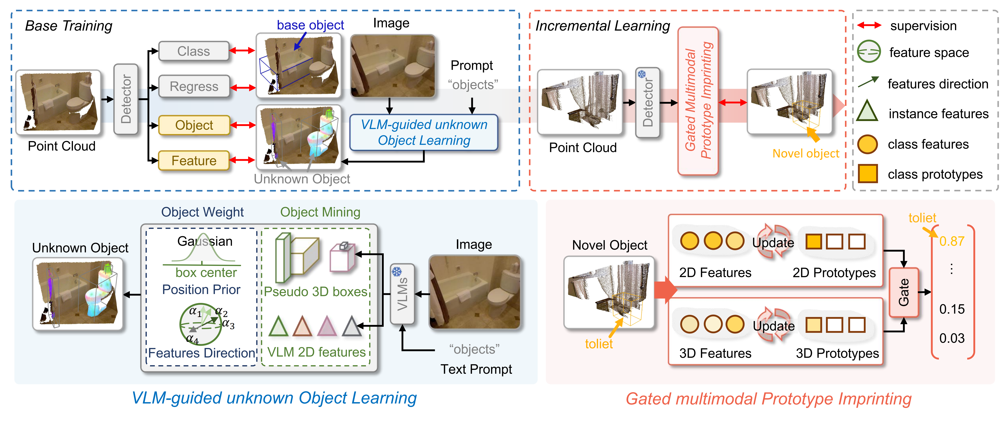

<p align="center"></p>

This project provides the code and results for 'Few-Shot Incremental 3D Object Detection in Dynamic Indoor Environments', CVPR 2026.

Anchors: [Yun Zhu](https://scholar.google.com/citations?user=eIZeK58AAAAJ&hl=zh-CN), [Jianjun Qian](https://scholar.google.com/citations?user=oLLDUM0AAAAJ&hl=zh-CN), [Jian Yang](https://scholar.google.com/citations?user=6CIDtZQAAAAJ&hl=zh-CN), [Jin Xie*](https://scholar.google.com/citations?user=Q7QqJPEAAAAJ&hl=zh-CN), [Na Zhao*](https://scholar.google.com/citations?hl=zh-CN&user=KOL2dMwAAAAJ)

PaperLink: https://arxiv.org/abs/2604.07997


### Introduction
> Incremental 3D object perception is a critical step toward embodied intelligence in dynamic indoor environments. 
However, existing incremental 3D detection methods rely on extensive annotations of novel classes for satisfactory performance. To address this limitation, we propose FI3Det, a Few-shot Incremental 3D Detection framework that enables efficient 3D perception with only a few novel samples by leveraging vision-language models (VLMs) to learn knowledge of unseen categories. FI3Det introduces a VLM-guided unknown object learning module in the base stage to enhance perception of unseen categories. Specifically, it employs VLMs to mine unknown objects and extract comprehensive representations, including 2D semantic features and class-agnostic 3D bounding boxes. To mitigate noise in these representations, a weighting mechanism is further designed to re-weight the contributions of point- and box-level features based on their spatial locations and feature consistency within each box. Moreover, FI3Det proposes a gated multimodal prototype imprinting module, where category prototypes are constructed from aligned 2D semantic and 3D geometric features to compute classification scores, which are then fused via a multimodal gating mechanism for novel object detection. As the first framework for few-shot incremental 3D object detection, we establish  both batch and sequential evaluation settings on two datasets, ScanNet V2 and SUN RGB-D, where FI3Det achieves strong and consistent improvements over baseline methods.

### Environment settings

- To install the environment, we follow [SPGroup3D](https://github.com/zyrant/SPGroup3D).

- All the `FI3Det`-related code locates in the folder [projects_incre](projects_incre).


###  Data Preparation

### 1. Datasets Preparation

- Follow the mmdetection3d data preparation protocol described in [scannet](https://github.com/open-mmlab/mmdetection3d/blob/main/data/scannet/README.md), [sunrgbd](https://github.com/open-mmlab/mmdetection3d/blob/main/data/sunrgbd/README.md). 
- Due to code refactoring and cleanup, issues may arise. Please refer to the mmdet3d implementation in the [TR3D](https://github.com/filaPro/tr3d) repository if needed.

### 2. Few-shot Incremental Splits

We provide the indoor few-shot incremental splits for **ScanNet V2** and **SUN RGB-D**.

* **Download:** Access the pre-processed files on [Google Drive](https://drive.google.com/drive/folders/1VijQJR0LLTHd1jq6SeM7rcZeJAaRLquY?usp=sharing).
* **Custom Generation:** Alternatively, you can generate your own `.pkl` files using:
```bash
python projects_incre/creat_few_shot_increment_pkl.py
```

### 3. Unknown Boxes and Features

Pre-generated boxes and features are available for both datasets.

* **Download:** Access the data on [Google Drive](https://drive.google.com/drive/folders/1jrqNEk1nESbqo49Q-6D54DjuAVB9q9ux?usp=sharing).
* **Self-Generation Pipeline:** **TBD**

## Training

The training process of **FI3Det** consists of two stages. You can initiate training using the [train.py](tools/train.py) script.

### 1. Base Stage
In this stage, the model is trained on base classes to establish a foundation for incremental learning.
* **Configurations:** `projects_incre/configs/base_stage/`
```bash
# Example for ScanNet V2 (9-way)
python tools/train.py projects_incre/configs/base_stage/tr3d_scannet-3d-9_class.py
```
> [!IMPORTANT]
> Ensure you have prepared the required `.pkl` files and pseudo boxes as described in the **Data Preparation** section before starting.

### 2. Incremental Stage
After the base stage, you can perform either **Batch** or **Sequential** incremental learning.

* **Configurations:** `projects_incre/configs/Incremental_stage/`

#### A. Batch Incremental Learning
Used for one-time expansion of novel classes.
```bash
# Example for ScanNet V2 (9-way 5-shot)
python tools/train.py projects_incre/configs/Incremental_stage/scannet/tr3d_scannet-3d-9_5_class.py
```
* **SUN RGB-D:**

```bash
# Example for SUN RGB-D (5-way 5-shot)
python tools/train.py projects_incre/configs/Incremental_stage/sunrgbd/tr3d_sunrgbd-3d-5_5_class.py
```

#### B. Sequential Incremental Learning

Used for multi-stage continuous learning (Task 1 → Task 2 → Task 3).
* **ScanNet V2:**
```bash
python tools/train.py projects_incre/configs/Incremental_stage/scannet/tr3d_scannet-3d-9_5_class_sq.py
```
* **SUN RGB-D:**
```bash
python tools/train.py projects_incre/configs/Incremental_stage/sunrgbd/tr3d_sunrgbd-3d-5_5_class_sq.py
```


##  Evaluation

To evaluate a pre-trained model, use the [test.py](tools/test.py) script with the corresponding configuration files.

### 1. Evaluate Batch Incremental Models
Use this for evaluating models trained in a single incremental step (e.g., 9-way 5-shot).
```bash
  # Example for ScanNet V2 (9-way 5-shot)
  python tools/test.py projects_incre/configs/Incremental_stage/scannet/tr3d_scannet-3d-9_5_class.py \
      ${CHECKPOINT_PATH} --eval mAP
```

### 2. Evaluate Sequential Incremental Models
Use this for evaluating models at specific task stages.
```bash
# Example for SUN RGB-D (Task 2)
python tools/test.py projects_incre/configs/Incremental_stage/sunrgbd/tr3d_sunrgbd-3d-5_5_class_sq.py \
    ${CHECKPOINT_PATH} --eval mAP
```

### Model Zoo and Weights

#### 1. Batch Incremental (ScanNet V2 & SUN RGB-D)

| Dataset | Setting | Base mAP | Novel mAP | All mAP | Download | Config |
| --- | --- | --- | --- | --- | --- | --- |
| **ScanNet V2** | 1-way 1-shot | 72.85 | 35.58 | 70.78 | [Link](https://drive.google.com/drive/folders/1VijQJR0LLTHd1jq6SeM7rcZeJAaRLquY?usp=sharing) | [config](projects_incre/configs/Incremental_stage/scannet/tr3d_scannet-3d-1_1_class.py) |
| **ScanNet V2** | 1-way 5-shot | 72.84 | 38.48 | 70.94 | [Link](https://drive.google.com/drive/folders/1VijQJR0LLTHd1jq6SeM7rcZeJAaRLquY?usp=sharing) | [config](projects_incre/configs/Incremental_stage/scannet/tr3d_scannet-3d-1_5_class.py) |
| **ScanNet V2** | 9-way 1-shot | 72.27 | 30.81 | 51.54 | [Link](https://drive.google.com/drive/folders/1VijQJR0LLTHd1jq6SeM7rcZeJAaRLquY?usp=sharing) | [config](projects_incre/configs/Incremental_stage/scannet/tr3d_scannet-3d-9_1_class.py) |
| **ScanNet V2** | 9-way 5-shot | 72.28 | 30.23 | 51.26 | [Link](https://drive.google.com/drive/folders/1VijQJR0LLTHd1jq6SeM7rcZeJAaRLquY?usp=sharing) | [config](projects_incre/configs/Incremental_stage/scannet/tr3d_scannet-3d-9_5_class.py) |
| **SUN RGB-D** | 1-way 1-shot | 63.06 | 67.29 | 63.48 | [Link](https://drive.google.com/drive/folders/1VijQJR0LLTHd1jq6SeM7rcZeJAaRLquY?usp=sharing) | [config](projects_incre/configs/Incremental_stage/sunrgbd/tr3d_sunrgbd-3d-1_1_class.py) |
| **SUN RGB-D** | 1-way 5-shot | 63.05 | 73.17 | 64.07 | [Link](https://drive.google.com/drive/folders/1VijQJR0LLTHd1jq6SeM7rcZeJAaRLquY?usp=sharing) | [config](projects_incre/configs/Incremental_stage/sunrgbd/tr3d_sunrgbd-3d-1_5_class.py) |
| **SUN RGB-D** | 5-way 1-shot | 62.49 | 15.27 | 38.88 | [Link](https://drive.google.com/drive/folders/1VijQJR0LLTHd1jq6SeM7rcZeJAaRLquY?usp=sharing) | [config](projects_incre/configs/Incremental_stage/sunrgbd/tr3d_sunrgbd-3d-5_1_class.py) |
| **SUN RGB-D** | 5-way 5-shot | 62.49 | 26.81 | 44.65 | [Link](https://drive.google.com/drive/folders/1VijQJR0LLTHd1jq6SeM7rcZeJAaRLquY?usp=sharing) | [config](projects_incre/configs/Incremental_stage/sunrgbd/tr3d_sunrgbd-3d-5_5_class.py) |

#### 2. Sequential Incremental

| Dataset | Task Stage | Base mAP | Novel mAP | All mAP | Download | Config |
| --- | --- | --- | --- | --- | --- | --- |
| **ScanNet V2** | Task 1  | 72.27 | 13.14 | 57.50 | [Link](https://drive.google.com/drive/folders/1VijQJR0LLTHd1jq6SeM7rcZeJAaRLquY?usp=sharing) | [config](projects_incre/configs/Incremental_stage/scannet/tr3d_scannet-3d-9_5_class_sq.py) |
| **ScanNet V2** | Task 2 | 72.30 | 21.06 | 51.80 | [Link](https://drive.google.com/drive/folders/1VijQJR0LLTHd1jq6SeM7rcZeJAaRLquY?usp=sharing) | [config](projects_incre/configs/Incremental_stage/scannet/tr3d_scannet-3d-9_5_class_sq.py) |
| **ScanNet V2** | Task 3  | 72.27 | 30.34 | 51.31 | [Link](https://drive.google.com/drive/folders/1VijQJR0LLTHd1jq6SeM7rcZeJAaRLquY?usp=sharing) | [config](projects_incre/configs/Incremental_stage/scannet/tr3d_scannet-3d-9_5_class_sq.py) |
| **SUN RGB-D** | Task 1 | 63.56 | 13.02 | 44.61 | [Link](https://drive.google.com/drive/folders/1VijQJR0LLTHd1jq6SeM7rcZeJAaRLquY?usp=sharing) | [config](projects_incre/configs/Incremental_stage/sunrgbd/tr3d_sunrgbd-3d-5_5_class_sq.py) |
| **SUN RGB-D** | Task 2  | 62.49 | 19.04 | 40.76 | [Link](https://drive.google.com/drive/folders/1VijQJR0LLTHd1jq6SeM7rcZeJAaRLquY?usp=sharing) | [config](projects_incre/configs/Incremental_stage/sunrgbd/tr3d_sunrgbd-3d-5_5_class_sq.py) |

Due to the size of these datasets and the randomness that inevitably exists in the model,  the results on these datasets fluctuate significantly. It's normal for results to fluctuate within a range.

### Citation

If you find this work useful for your research, please cite our paper:

```
@inproceedings{fi3det,
  title={Few-Shot Incremental 3D Object Detection in Dynamic Indoor Environments},
  author={Yun Zhu and Jianjun Qian and Jian Yang and Jin Xie and Na Zhao},
  booktitle={CVPR},
  year={2026}
}
```

### Acknowledgments

This project is based on the following codebases.
- [mmdetection3D](https://github.com/open-mmlab/mmdetection3d)
- [TR3D](https://github.com/SamsungLabs/tr3d)
- [SegmentAnything3D](https://github.com/Pointcept/SegmentAnything3D) 
- [EfficientSAM](https://github.com/yformer/EfficientSAM) 
- [GroundingDINO](https://github.com/IDEA-Research/GroundingDINO)

If you find this project helpful, please also cite the codebases above. Thanks.
